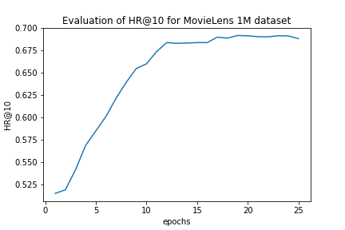
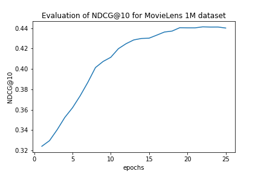

# NeuralCollaborativeFiltering_Pytorch
This is my end-to-end pytorch implementation of [Neural Collaborative Filtering](https://arxiv.org/abs/1708.05031). The repo implements the  Neural matrix factorization model without pretraining.

## 1. ABSTRACT

The key to a personalized recommender system is in modelling users’ preference on items based on their past interactions (e.g., ratings and clicks), known as collaborative filtering. Among the various collaborative filtering techniques, matrix factorization is the most popular one, which projects users and items into a shared latent space, using a vector of latent features to represent a user or an item. Thereafter a user’s interaction on an item is modelled as the inner product of their latent vectors.

The proposed neural matrix factorization model, which ensembles MF and MLP under the NCF framework; it unifies the strengths of linearity of MF and non-linearity of MLP for modelling the user–item latent structures

## 2. DATASET CREATION

The repo uses the ratings.dat file from [MovieLens 1Million Dataset](https://grouplens.org/datasets/movielens/1m/). To create the train and test dataset, leave-one-out formulation has been implemented where for each user, we held-out his/ her latest interaction as the test set and utilized the remaining data for training. 

As the paper has been formulated as a Binary CLassification Problem, we sampled four negative instances per positive instance during training. For evaluation, we randomly sampled 100 items that are not interacted by the user, ranking the levae-one-out test item among the 100 items. The performance of a ranked list is judged by Hit Ratio (HR) and Normalized Discounted Cumulative Gain (NDCG).

To create the training & testing dataset, place the ratings.dat in /data folder run the following command:

`python dataset_creation.py --file_path data/ratings.dat --trainpos_path data/ratings_train_pos --testpos_path data/ratings_test_pos --trainneg_path data/ratings_train_neg --testneg_path data/ratings_test_neg --n_train_negatives 4 --n_test_negatives 100`

Here,
file_path: path of the ratings.dat file
trainpos_path: file containing all user-item interaction except the user's last interaction in (user_id, movie_id) format
testpos_path: based on leave-one-out formulation containing the latest item for each user in (user_id, movie_id) format
trainneg_path: file containing negative data i.e. no user-item interaction. Four negative instances (n_train_negatives) per positive instance is created for training in (user_id, movie_id) format. Note that negative instances are simply movies not interacted by the user
testneg_path: randomly sampled 100 items that are not interacted by the user. For each positive instances in testpos_path, we have sampled 99 (n_test_negatives-1) negative instances in (user_id, movied_id) followed by 99 non-interacted movie_ids by the corresponding user.

## 3. Model Training

To train the neural matrix factorization model, simply run the following command:

`python train.py --ratings_train_pos_path data/ratings_train_pos --ratings_train_neg_path data/ratings_train_neg --ratings_test_path data/ratings_test_neg --epochs 25`

where, epochs is the number of epochs the model needs to be trained. By default, it supports CUDA training, if its available.

## 4. Results

The model was training without initialization for 25 epochs. The HR@10 and NDCF@10 is summarizeed in the figure below:

| ||
|-|-|

